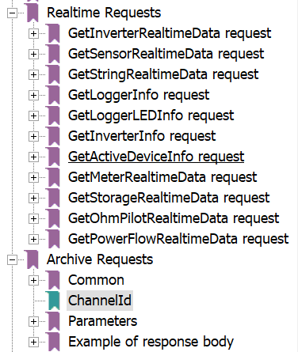

# API Fronius

Para la integración de Fronius se han considerado tres APIs.

## [API Solar.web Query API](SE_UI_API_InterfaceDocumentation_EN.PDF)

### Pros y cons

- Pros:

  - Accesible universalmente (API en la nube).
  - Posiblemente sean las métricas que el cliente esté acostumbrado a ver, y con las que sea necesario ser consistente.
  - La jerarquía (PV System > DataLogger > Device) es de más alto nivel y puede ser más familiar para el cliente (Los PV Systems agregan métricas de uno o varios DataLoggers o Inverters bajo unos nombres "amigables" como `Beniata derecha`, `EIMA Jesuset del Miracle`, etc).

- Cons:

  - Tiene un coste asociado, en función del número de peticiones mensuales, y de datos incluidos en la petición. Esto puede hacer que la integración incurra en un coste:


### Dispositos

La API puede reportar información en tiempo real (`flowdata`), histórica en intervalos de 5 minutos (`histdata`), y agregada en intervalos diarios, semanales, mensuales o anuales (`aggrdata`), a los siguientes niveles:

- PV System: Conjunto de dataloggers asociados a una ubicación (`Beniata derecha`, `EIMA Jesuset del Miracle`, `Cotes Baixes Norte`, `Tomas Llacer`, etc).
- Device: dispositivo individual de un PV System:

  - Inverter
  - DataLogger
  - SmartMeter

**Nota**: Aunque la API soporta más Device Types, haciendo un barrido de la cuenta del cliente sólo se han detectado estos tipos. Así que por el momento, son los únicos que se tratan.

### Tiempo real

En tiempo real, esta es la información que puede obtenerse de un PV System:


Y esta, la que puede obtenerse de un Inverter o un Meter:


Esta API no proporciona información en tiempo real por datalogger.

### Histórico

De forma **histórica**, la API recolecta esta información periódicamente (por defecto, cada hora) y la agrega por intervalos (por defecto, 5 minutos).


Para un PV System, esta es la información histórica:


Este es un ejemplo extraído de la API actual:

```json
{"pvSystemId": "7e7aa106-19ea-4f79-ac69-e42883668ec7",
 "deviceId": None,
 "data": [{"logDateTime": "2021-06-17T18:35:00Z",
   "logDuration": 299,
   "channels": [{"channelName": "EnergySelfConsumption",
     "channelType": "Energy",
     "unit": "Wh",
     "value": 0.0},
    {"channelName": "EnergyFeedIn",
     "channelType": "Energy",
     "unit": "Wh",
     "value": 0.0},
    {"channelName": "EnergyBattCharge",
     "channelType": "Energy",
     "unit": "Wh",
     "value": 0.0},
    {"channelName": "EnergyBattDischargeGrid",
     "channelType": "Energy",
     "unit": "Wh",
     "value": 0.0},
    {"channelName": "EnergyBattDischarge",
     "channelType": "Energy",
     "unit": "Wh",
     "value": 0.0},
    {"channelName": "EnergyPurchased",
     "channelType": "Energy",
     "unit": "Wh",
     "value": 0.0},
    {"channelName": "EnergyBattChargeGrid",
     "channelType": "Energy",
     "unit": "Wh",
     "value": 0.0},
    {"channelName": "EnergyOutput",
     "channelType": "Energy",
     "unit": "Wh",
     "value": 12.45},
    {"channelName": "EnergyProductionTotal",
     "channelType": "Energy",
     "unit": "Wh",
     "value": 12.45},
    {"channelName": "EnergySelfConsumptionTotal",
     "channelType": "Energy",
     "unit": "Wh",
     "value": 0.0},
    {"channelName": "EnergyConsumptionTotal",
     "channelType": "Energy",
     "unit": "Wh",
     "value": 0.0}]},
  {"logDateTime": "2021-06-17T18:40:00Z",
   "logDuration": 300,
   "channels": [{"channelName": "EnergySelfConsumption",
     "channelType": "Energy",
     "unit": "Wh",
     "value": 0.0},
    {"channelName": "EnergyFeedIn",
     "channelType": "Energy",
     "unit": "Wh",
     "value": 0.0},
    {"channelName": "EnergyBattCharge",
     "channelType": "Energy",
     "unit": "Wh",
     "value": 0.0},
    {"channelName": "EnergyBattDischargeGrid",
     "channelType": "Energy",
     "unit": "Wh",
     "value": 0.0},
    {"channelName": "EnergyBattDischarge",
     "channelType": "Energy",
     "unit": "Wh",
     "value": 0.0},
    {"channelName": "EnergyPurchased",
     "channelType": "Energy",
     "unit": "Wh",
     "value": 0.0},
    {"channelName": "EnergyBattChargeGrid",
     "channelType": "Energy",
     "unit": "Wh",
     "value": 0.0},
    {"channelName": "EnergyOutput",
     "channelType": "Energy",
     "unit": "Wh",
     "value": 11.15},
    {"channelName": "EnergyProductionTotal",
     "channelType": "Energy",
     "unit": "Wh",
     "value": 11.15},
    {"channelName": "EnergySelfConsumptionTotal",
     "channelType": "Energy",
     "unit": "Wh",
     "value": 0.0},
    {"channelName": "EnergyConsumptionTotal",
     "channelType": "Energy",
     "unit": "Wh",
     "value": 0.0}]},
  {"logDateTime": "2021-06-17T18:45:00Z",
   "logDuration": 299,
   "channels": [{"channelName": "EnergySelfConsumption",
     "channelType": "Energy",
     "unit": "Wh",
     "value": 0.0},
    {"channelName": "EnergyFeedIn",
     "channelType": "Energy",
     "unit": "Wh",
     "value": 0.0},
    {"channelName": "EnergyBattCharge",
     "channelType": "Energy",
     "unit": "Wh",
     "value": 0.0},
    {"channelName": "EnergyBattDischargeGrid",
     "channelType": "Energy",
     "unit": "Wh",
     "value": 0.0},
    {"channelName": "EnergyBattDischarge",
     "channelType": "Energy",
     "unit": "Wh",
     "value": 0.0},
    {"channelName": "EnergyPurchased",
     "channelType": "Energy",
     "unit": "Wh",
     "value": 0.0},
    {"channelName": "EnergyBattChargeGrid",
     "channelType": "Energy",
     "unit": "Wh",
     "value": 0.0},
    {"channelName": "EnergyOutput",
     "channelType": "Energy",
     "unit": "Wh",
     "value": 11.03},
    {"channelName": "EnergyProductionTotal",
     "channelType": "Energy",
     "unit": "Wh",
     "value": 11.03},
    {"channelName": "EnergySelfConsumptionTotal",
     "channelType": "Energy",
     "unit": "Wh",
     "value": 0.0},
    {"channelName": "EnergyConsumptionTotal",
     "channelType": "Energy",
     "unit": "Wh",
     "value": 0.0}
  ]
}
```

Para un `inverter` o `meter`, sería esta:


Como observación **importante**, la API en tiempo real proporciona **Potencias**, mientras que la API histórica proporciona **Energías (potencia * tiempo)**. Esto puede hacerlo porque los datos los calcula el inverter, con una periodicidad fija:


Convertir un dato en otro requiere tener datos del flujo de potencia durante todo el intervalo, no se puede derivar directamente de las medidas de potencia en el principio y el fin del intervalo. Cualquier medida de energía no debe derivarse de datos de potencia, sino que debe tomarse de Fronius con la periodicidad y granularidad que proporciona su API.

### Agregado

La información agregada es muy similar a la información histórica, pero con una granularidad distinta (diaria, semanal, mensual o anual). Para un PV System, esta es la información agregada:


Para un inverter, sería esta:


Como se observa, es básicamente un subconjunto de la información que se puede obtener de forma histórica, pero *complementada* con algunos cálculos a nivel del `PV system`, como el ahorro de CO2 o los ahorros del sistema.

Estos son valores calculados que podrían omitirse o calcularse en la plataforma, por lo que no se considera necesario incluir la API agregada en la integración.

### Resumen

Como resumen, esta tabla recopila los `channels` (métricas) que expone esta API en función del dispositivo y la diferencia entre tiempo real e histórico.

**NOTA**: Las unidades se han extraído de la API con las credenciales del cliente. Los canales que no tienen unidades (`C-)`, es porque no aparecen en la API para el proyecto del cliente, por lo que quizá que no están disponibles en el proyecto del cliente.

| Device | Realtime channels (bajo demanda) | Historical channels (cada 5 mins) |
| ------ | -------------------------------- | --------------------------------- |
| PV System | PowerFeedIn (Power, W) | EnergySelfConsumption (Energy, Wh) |
| PV System | PowerLoad (Power, W) | EnergyFeedIn (Energy, Wh) |
| PV System | PowerBattCharge (Power, W) | EnergyBattCharge (Energy, Wh) |
| PV System | PowerPV (Power, W) | EnergyBattDischargeGrid (Energy, Wh) |
| PV System | PowerOutput (Power, W) | EnergyBattDischarge (Energy, Wh) |
| PV System | BattSOC (Percentage, %) | EnergyPurchased (Energy, Wh) |
| PV System | RateSelfConsumption (Percentage, %) | EnergyBattChargeGrid (Energy, Wh) |
| PV System | RateSelfSufficiency (Percentage, %) | EnergyOutput (Energy, Wh) |
| PV System | | EnergyPurchased (-) |
| PV System | | EnergyProductionTotal (Energy, Wh) |
| PV System | | EnergySelfConsumptionTotal (Energy, Wh) |
| PV System | | EnergyConsumptionTotal (Energy, Wh) |
| Inverter | PowerOutput (Power, W) | EnergyExported (Energy, Wh) |
| Inverter |  | EnergyImported (-) |
| Inverter |  | StandardizedPower (Percentage, %) |
| Inverter |  | VoltageA (Voltage, V) |
| Inverter |  | VoltageB (Voltage, V) |
| Inverter |  | VoltageC (Voltage, V) |
| Inverter |  | CurrentA (Current, A) |
| Inverter |  | CurrentB (Current, A) |
| Inverter |  | CurrentC (Current, A) |
| Inverter |  | VoltageDC1 (Voltage, V) |
| Inverter |  | CurrentDC1 (Current, A) |
| Inverter |  | VoltageDC2 (Voltage, V) |
| Inverter |  | CurrentDC2 (Current, A) |
| Inverter |  | ReactivePower (Reactive Power, VAr) |
| Inverter |  | ApparentPower (Apparent Power, VA) |
| Inverter |  | PowerFactor |
| Inverter |  | EnergyDC1 (Energy, Wh) |
| Inverter |  | EnergyDC2 (Energy, Wh) |
| Inverter |  | VoltageAB (Voltage, V) |
| Inverter |  | VoltageBC (-) |
| Inverter |  | VoltageCA (-) |
| SmartMeter | PowerFeedIn (Power, W)  | GridEnergyExported (Energy, Wh) |
| SmartMeter | PowerLoad (-) | GridEnergyImported (Energy, Wh) |
| SmartMeter | PowerExt (-) | GridPowerA (Power, W) |
| SmartMeter | PowerPurchased (-) | GridPowerB (Power, W) |
| SmartMeter | | GridPowerC (Power, W) |
| SmartMeter | | GridApparentPowerA (Apparent Power, VA) |
| SmartMeter | | GridApparentPowerB (Apparent Power, VA) |
| SmartMeter | | GridApparentPowerC (Apparent Power, VA) |
| SmartMeter | | GridVoltageA (Voltage, V) |
| SmartMeter | | GridVoltageB (Voltage, V) |
| SmartMeter | | GridVoltageC (Voltage, V) |
| SmartMeter | | LoadPowerA (-) |
| SmartMeter | | LoadPowerB (-) |
| SmartMeter | | LoadPowerC (-) |
| SmartMeter | | LoadApparentPowerA (-) |
| SmartMeter | | LoadApparentPowerB (-) |
| SmartMeter | | LoadApparentPowerC (-) |
| SmartMeter | | LoadVoltageA (-) |
| SmartMeter | | LoadVoltageB (-) |
| SmartMeter | | LoadVoltageC (-) |
| SmartMeter | | GridEnergyExportedAbs (Energy, Wh) |
| SmartMeter | | GridEnergyImportedAbs (Energy, Wh) |
| SmartMeter | | EnergyLoad (-) |
| SmartMeter | | EnergyLoadAbs (-) |
| SmartMeter | | ExtEnergyExported (-) |
| SmartMeter | | ExtEnergyExportedAbs (-) |

Aplicando los costes de la API Web, si leyéramos todos los datos una vez al día, el consumo diarío sería:

PV System: 12 datapoints => 11 * 12 * 24 = 3168 creditos por PV y día.
Inverter: 18 datapoints * 12 * 24 = 5184 créditos por inverter y día.
SmartMeter: 13 datapoints * 12 * 24 = 3744 créditos por smartmeter y día.

El sistema del cliente tiene actualmente 17 pvsystems con 18 inverters y 12 meters => 17 * 3168 + 18 * 5184 + 12 * 3744 => aprox. 200k créditos por día => **aprox. 6M créditos / mes**, lo que lo clasificaría como un sistema **Medium** según la tabla de costes de Fronius.

## [API Solar v1](Manual_Solar_API_V1.pdf)

### Pros y cons

- Pros:

  - No tiene coste.

- Cons:

  - Necesita acceso directo a los dataloggers.

    - Hay que proporcionar a la ETL las IPs internas de los dataloggers.
    - Hay que actualizar esas IPs si cambian.
    - Hay que garantizar que la ETL alcanza esas IPs, a través de firewall o incluso diferentes redes IT / OT.

  - No entiende de PV systems, solo de dataloggers.

    - La relación entre datalogger o PV System hay que sacarla de la API Solar.web, o introducirla manualmente. En algunos PV systems, como `Santiago Paya Izquierda`, el cliente tiene dos dataloggers.
    - Hay que conocer e implementar la lógica de cómo se pueden derivar los datos de un PV system a partir de sus dataloggers.
    - Si hay varios dataloggers, puede que los datos calculados para un PV system no coincidan con los de la web de fronius, por ejemplo por motivos de sincronización.

### Dispositivos

La API permite dos tipos de consulta: tiempo real y archivo (histórico). El archivo está limitado a la memoria interna del datalogger. Cada una de estas queries admite dos **alcances** (`scope`): `system` y `device`, análogo a la API solar.web pero en este caso `system` se refiere solo al datalogger, no al PV System.



Dentro de estas queries, las *Info* son de inventario, no son para obtener datos. Y las de `Sensor` y `OhmPilot` se refieren a un dispositivo que no se ha descubierto en la instalación del cliente. Por lo que a efectos de integración de datos, nos centraremos en:

- GetInverterRealTimeData
- GetMeterRealTimeData
- GetStorageRealTimeData
- GetPowerFlowRealTimeData

Las Archive Requests para esos mismos dispositivos.

### InverterRealTimeData

Esta API devuelve:
- A nivel datalogger (`scope = sytem`): Potencia AC y energía generada durante el día actual, año actual, o desde el último reset.
- A nivel dispositivo (`scope = device`): Potencia AC por fase, intensidades y tensiones AC y DC, energía generada durante el día actual, año actual o desde el último reset.


### PowerFlowRealTimeData

Esta API sólo tiene un alcance y colección, devuelve un conjunto de datos fijo para el datalogger y cada uno de sus inversores, que complementan a los datos de la query anterior:


`Site` (DataLogger):

```ini
# mandatory field
# "produce -only", "meter", "vague -meter", "bidirectional" or "ac-coupled"
string Mode;
# optional field , supported since Fronius Hybrid version 1.4.1-6
# not available on Fronius Non Hybrid
# true when battery is in standby
boolean BatteryStandby;
# optional field , supported since Fronius Hybrid version 1.3.1-0
# not available on Fronius Non Hybrid
# field is available if configured (false) or active (true)
# if not available , mandatory config is not set
boolean BackupMode;
# mandatory field
#this value is null if no meter is enabled ( + from grid , - to grid )
number P_Grid;
# mandatory field
#this value is null if no meter is enabled ( + generator , - consumer )
number P_Load;
# mandatory field
#this value is null if no battery is active ( + charge , - discharge )
number P_Akku;
# mandatory field
#this value is null if inverter is not running ( + production ( default ) )
number P_PV;
# mandatory field
# available since Fronius Hybrid version 1.3.1-1
# available since Fronius Non Hybrid version 3.7.1-2
# current relative self consumption in %, null if no smart meter is connected
number rel_SelfConsumption;
# mandatory field
# available since Fronius Hybrid version 1.3.1-1
# available since Fronius Non Hybrid version 3.7.1-2
# current relative autonomy in %, null if no smart meter is connected
number rel_Autonomy;
# optional field
# "load", "grid" or "unknown" (during backup power)
string Meter_Location;
# optional field
# implemented since Fronius Non Hybrid version 3.4.1-7
# Energy [Wh] this day, null if no inverter is connected
number E_Day;
# optional field
# implemented since Fronius Non Hybrid version 3.4.1-7
# Energy [Wh] this year , null if no inverter is connected
number E_Year;
# optional field
# implemented since Fronius Non Hybrid version 3.4.1-7
# Energy [Wh] ever since , null if no inverter is connected
number E_Total;
```

`Inverter`:

```ini
# mandatory field
# device type of inverter
integer DT;
# mandatory field
# current power in Watt , null if not running
integer P;
# optional field
# current state of charge in % ( 0 - 100% )
integer SOC;
# optional field
# "disabled", "normal", "service", "charge boost",
# "nearly depleted", "suspended", "calibrate",
# "grid support", "deplete recovery", "non operable (voltage)",
# "non operable (temperature)", "preheating" or "startup"
string Battery_Mode;
# optional field
# implemented since Fronius Non Hybrid version 3.7.1-1
# Fronius Hybrid version 1.3.1-1
# Energy [Wh] this day, null if no inverter is connected
number E_Day;
# optional field
# implemented since Fronius Non Hybrid version 3.7.1-1
# Fronius Hybrid version 1.3.1-1
# Energy [Wh] this year , null if no inverter is connected
number E_Year;
# optional field
# implemented since Fronius Non Hybrid version 3.7.1-1
# Fronius Hybrid version 1.3.1-1
# Energy [Wh] ever since , null if no inverter is connected
number E_Total;
```

### MeterRealTimeData

Este endpoint también soporta dos alcances `system` o `device`, pero la única diferencia es que el scope `system` devuelve datos de todos los meters, mientras que el scope `device` solo los devuelve de uno. Los datos que obtiene son:

```json
{
    "TimeStamp" : 1406816001,
    "Enable" : 1,
    "Visible" : 1,
    "PowerReal_P_Sum" : -834.13,
    "Meter_Location_Current" : 0,
    "PowerReal_P_Phase_1" : -261.86,
    "PowerReal_P_Phase_2" : -296.26,
    "PowerReal_P_Phase_3" : -276.01,
    "PowerReactive_Q_Sum" : 489.34,
    "PowerReactive_Q_Phase_1" : 169.63,
    "PowerReactive_Q_Phase_2" : 158.39,
    "PowerReactive_Q_Phase_3" : 161.32,
    "Current_AC_Phase_1" : 1.43,
    "Current_AC_Phase_2" : 1.522,
    "Current_AC_Phase_3" : 1.44,
    "Voltage_AC_Phase_1" : 233.1,
    "Voltage_AC_Phase_2" : 234.4,
    "Voltage_AC_Phase_3" : 233.8,
    "Voltage_AC_PhaseToPhase_12" : 404.9,
    "Voltage_AC_PhaseToPhase_23" : 405.5,
    "Voltage_AC_PhaseToPhase_31" : 404.3,
    "Frequency_Phase_Average" : 50,
    "PowerApparent_S_Sum" : 967,
    "PowerFactor_Sum" : 0.86,
    "PowerFactor_Phase_1" : 0.83,
    "PowerFactor_Phase_2" : 0.88,
    "PowerFactor_Phase_3" : 0.86,
    "EnergyReal_WAC_Sum_Produced" : 33989,
    "EnergyReal_WAC_Sum_Consumed" : 1365,
    "EnergyReactive_VArAC_Sum_Produced" : 4020,
    "EnergyReactive_VArAC_Sum_Consumed" : 204310,
    "EnergyReal_WAC_Plus_Absolute" : 1365,
    "EnergyReal_WAC_Minus_Absolute" : 33989
}
```

### StorageRealTimeData

Esta API proporciona información sobre **baterías** de distintos dispositivos, a dos niveles: `controller` y `modules`. Para cada nivel, reporta los siguientes canales:

```json
{
"TimeStamp" : 1436507345,
"Enable" : 1,
"StateOfCharge_Relative" : 5,
"Voltage_DC" : 46.292,
"Current_DC" : -0.02,
"Temperature_Cell" : 26,
"Voltage_DC_Maximum_Cell" : 2.928,
"Voltage_DC_Minimum_Cell" : 2.87,
"Temperature_Cell_Maximum" : 26.6,
"Temperature_Cell_Minimum" : 25.8,
"CycleCount_BatteryCell" : 8,
"Status_BatteryCell" : 50,
"DesignedCapacity" : 1200
}
```

### Archive

Las queries de Archive permiten consultar el valor histórico de algunos de los `channels` anteriores, almacenados en intervalos de tiempo prefijados (típicamente cada 5 minutos), con scope `system` o `device`.

Los canales que se archivan y se pueden consultar son:


### Resumen

Como resumen, esta tabla recopila los `channels` (métricas) que expone esta API en función del dispositivo y la diferencia entre tiempo real y archivado:

| Device | Realtime (bajo demanda) | Archive (cada 5 mins) |
| ------ | ----------------------- | --------------------- |
| Inverter | PAC (AC power) | |
| Inverter | SAC (unsigned AC power) | |
| Inverter | IAC (AC current) | |
| Inverter | IAC_L1 (AC current phase 1) | |
| Inverter | IAC_L2 (AC current phase 2) | |
| Inverter | IAC_L3 (AC current phase 3) | |
| Inverter | UAC (AC Power) | |
| Inverter | UAC_L1 (AC Voltage Phase 1) | |
| Inverter | UAC_L2 (AC Voltage Phase 2) | |
| Inverter | UAC_L3 (AC Voltage Phase 3) | |
| Inverter | FAC (AC Frequency) | |
| Inverter | IDC (DC Current) | |
| Inverter | UDC (DC Voltage) | |
| Inverter | DAY_ENERGY | |
| Inverter | YEAR_ENERGY | |
| Inverter | TOTAL_ENERGY | |
| Inverter | DT | |
| Inverter | P | |
| Inverter | SOC | |
| Inverter | Battery_Mode | |
| Inverter | E_Day | |
| Inverter | E_Year | |
| Inverter | E_Total | |
| DataLogger | PAC | |
| DataLogger | DAY_ENERGY | |
| DataLogger | YEAR_ENERGY | |
| DataLogger | TOTAL_ENERGY | |
| DataLogger | Device status | |
| DataLogger | Mode | |
| DataLogger | BatteryStandby | |
| DataLogger | BackupMode | |
| DataLogger | P_Grid | |
| DataLogger | P_Load | |
| DataLogger | P_Akku | |
| DataLogger | P_PV | |
| DataLogger | rel_SelfConsumption | |
| DataLogger | rel_Autonomy | |
| DataLogger | Meter_Location | |
| DataLogger | E_Day | |
| DataLogger | E_Year | |
| DataLogger | E_Total | |
| Meter | PowerReal_P_Sum | PowerReal_PAC_Sum |
| Meter | Meter_Location_Current | Meter_Location_Current |
| Meter | Current_AC_Phase_1 | Current_AC_Phase_1 |
| Meter | Current_AC_Phase_2 | Current_AC_Phase_2 |
| Meter | Current_AC_Phase_3 | Current_AC_Phase_3 |
| Meter | Voltage_AC_Phase_1 | Voltage_AC_Phase_1 |
| Meter | Voltage_AC_Phase_2 | Voltage_AC_Phase_2 |
| Meter | Voltage_AC_Phase_3 | Voltage_AC_Phase_3 |
| Meter | EnergyReal_WAC_Sum_Produced | EnergyReal_WAC_Sum_Produced |
| Meter | EnergyReal_WAC_Plus_Absolute | EnergyReal_WAC_Plus_Absolute |
| Meter | EnergyReal_WAC_Minus_Absolute | EnergyReal_WAC_Minus_Absolute |
| Meter | PowerReal_P_Phase_1 | |
| Meter | PowerReal_P_Phase_2 | |
| Meter | PowerReal_P_Phase_3 | |
| Meter | PowerReactive_Q_Sum | |
| Meter | PowerReactive_Q_Phase_1 | |
| Meter | PowerReactive_Q_Phase_2 | |
| Meter | PowerReactive_Q_Phase_3 | |
| Meter | EnergyReal_WAC_Sum_Consumed | |
| Meter | EnergyReactive_VArAC_Sum_Produced | |
| Meter | EnergyReactive_VArAC_Sum_Consumed | |
| Meter | Voltage_AC_PhaseToPhase_12 | |
| Meter | Voltage_AC_PhaseToPhase_23 | |
| Meter | Voltage_AC_PhaseToPhase_31 | |
| Meter | Frequency_Phase_Average | |
| Meter | PowerApparent_S_Sum | |
| Meter | PowerFactor_Sum | |
| Meter | PowerFactor_Phase_1 | |
| Meter | PowerFactor_Phase_2 | |
| Meter | PowerFactor_Phase_3 | |
| Battery (controller o modules) | StateOfCharge_Relative |
| Battery (controller o modules) | Voltage_DC |
| Battery (controller o modules) | Current_DC |
| Battery (controller o modules) | Temperature_Cell |
| Battery (controller o modules) | Voltage_DC_Maximum_Cell |
| Battery (controller o modules) | Voltage_DC_Minimum_Cell |
| Battery (controller o modules) | Temperature_Cell_Maximum |
| Battery (controller o modules) | Temperature_Cell_Minimum |
| Battery (controller o modules) | CycleCount_BatteryCell |
| Battery (controller o modules) | Status_BatteryCell |
| Battery (controller o modules) | DesignedCapacity |

**Nota**: No hemos incluido de momento canales de temperatura, comandos y errores.

No es obvio establecer una correspondencia inmediata entre estos canales y los canales expuestos por la API Solar.Web Query.

## [Servicio Push](fronius_push_service.pdf)

### Pros y cons

  - Pros:

    - No tiene coste.
    - Evita que la integración dependa de alcanzar las IPs de los dataloggers.

  - Cons:

    - La integración no puede ser por ETL, tiene que ser un servidor siempre disponible y alcanzable desde los dataloggers (posiblemente IP pública).
    - Esta API es equivalente a programar la ejecución periódica de una query de la API web (el DataLogger ejecuta periódicamente esa query y la envía al receptor de los mensajes push). Por lo tanto, hereda los cons de la API Solar v1, y añade algunas limitaciones propias:

      - Las queries que se pueden programar están predefinidas, son un subconjunto de lo que puede obtenerse de la API Web.
      - El número de queries distintas (informes) que se pueden enviar por push es limitado (10). De esos 10, algunos pueden estar ya ocupados para enviar los informes a la web de fronius.
      - Algunas de las queries sólo pueden programarse con una cierta frecuencia máxima (30 minutos, o una hora).
      - Aunque otras queries pueden programarse con una frecuencia tan baja como 10 segundos, en realidad la mayoría de los `channels` (métricas) sólo se actualizan a intervalos regulares, típicamente de 5 minutos.


### Devices

La API Push permite programar periódicamente hasta 10 de estos informes, para que sean enviados a un receptor por POST o FTP:


Al igual que en el punto anterior, de esta API nos centramos en informes relacionados con los dispositivos descubiertos en la cuenta del cliente:

- El informe CurrentData - Inverter es equivalente a realizar una query [InverterRealTimeData](#inverterrealtimedata) con scope `system`.
- El informe CurrentData - Meter es equivalente a una query [MeterRealTimeData](#meterrealtimedata) con scope `system`.
- El informe CurrentData - Storage es equivalente a una query [StorageRealTimeData](#storagerealtimedata) con scope `system`.
- El informe CurrentData - PowerFlow es equivalente a una query [Archive](#archive) con scope `system` y devices `Inverter+SensorCard+Meter`.

### Resumen

Como resumen, esta tabla recopila los `channels` (métricas) que expone esta API en función del dispositivo:

| Device | Realtime (bajo demanda) |
| ------ | ----------------------- |
| Inverter | PAC (AC power) |
| Inverter | DAY_ENERGY |
| Inverter | YEAR_ENERGY |
| Inverter | TOTAL_ENERGY |
| Inverter | DT |
| Inverter | P |
| Inverter | SOC |
| Inverter | Battery_Mode |
| Inverter | E_Day |
| Inverter | E_Year |
| Inverter | E_Total |
| DataLogger | PAC |
| DataLogger | DAY_ENERGY |
| DataLogger | YEAR_ENERGY |
| DataLogger | TOTAL_ENERGY |
| DataLogger | Device status |
| DataLogger | Mode |
| DataLogger | BatteryStandby |
| DataLogger | BackupMode |
| DataLogger | P_Grid |
| DataLogger | P_Load |
| DataLogger | P_Akku |
| DataLogger | P_PV |
| DataLogger | rel_SelfConsumption |
| DataLogger | rel_Autonomy |
| DataLogger | Meter_Location |
| DataLogger | E_Day |
| DataLogger | E_Year |
| DataLogger | E_Total |
| Meter | PowerReal_P_Sum |
| Meter | Meter_Location_Current |
| Meter | PowerReal_P_Phase_1 |
| Meter | PowerReal_P_Phase_2 |
| Meter | PowerReal_P_Phase_3 |
| Meter | PowerReactive_Q_Sum |
| Meter | PowerReactive_Q_Phase_1 |
| Meter | PowerReactive_Q_Phase_2 |
| Meter | PowerReactive_Q_Phase_3 |
| Meter | Current_AC_Phase_1 |
| Meter | Current_AC_Phase_2 |
| Meter | Current_AC_Phase_3 |
| Meter | Voltage_AC_Phase_1 |
| Meter | Voltage_AC_Phase_2 |
| Meter | Voltage_AC_Phase_3 |
| Meter | Voltage_AC_PhaseToPhase_12 |
| Meter | Voltage_AC_PhaseToPhase_23 |
| Meter | Voltage_AC_PhaseToPhase_31 |
| Meter | Frequency_Phase_Average |
| Meter | PowerApparent_S_Sum |
| Meter | PowerFactor_Sum |
| Meter | PowerFactor_Phase_1 |
| Meter | PowerFactor_Phase_2 |
| Meter | PowerFactor_Phase_3 |
| Meter | EnergyReal_WAC_Sum_Produced |
| Meter | EnergyReal_WAC_Sum_Consumed |
| Meter | EnergyReactive_VArAC_Sum_Produced |
| Meter | EnergyReactive_VArAC_Sum_Consumed |
| Meter | EnergyReal_WAC_Plus_Absolute |
| Meter | EnergyReal_WAC_Minus_Absolute |
| Battery (controller o modules) | StateOfCharge_Relative |
| Battery (controller o modules) | Voltage_DC |
| Battery (controller o modules) | Current_DC |
| Battery (controller o modules) | Temperature_Cell |
| Battery (controller o modules) | Voltage_DC_Maximum_Cell |
| Battery (controller o modules) | Voltage_DC_Minimum_Cell |
| Battery (controller o modules) | Temperature_Cell_Maximum |
| Battery (controller o modules) | Temperature_Cell_Minimum |
| Battery (controller o modules) | CycleCount_BatteryCell |
| Battery (controller o modules) | Status_BatteryCell |
| Battery (controller o modules) | DesignedCapacity |
